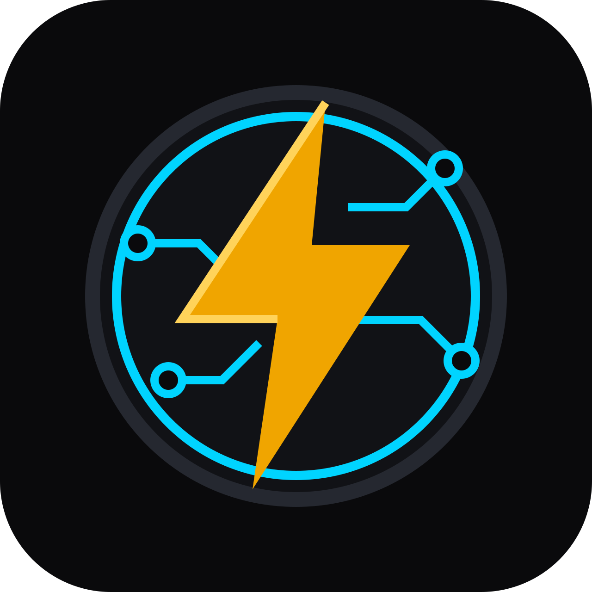

  

<h1 align="center">ElectraCore</h1>

  Electrical learning, calculation, and preliminary design tools with visible working.

  <a href="https://electracore.vercel.app">Live application</a> ·
  <a href="docs/PRODUCT-INVENTORY.md">Product inventory</a> ·
  <a href="docs/CURRICULUM-MATRIX.md">Curriculum matrix</a>

## Overview

ElectraCore brings practical electrical calculations, circuit-design checks, reference material, and structured learning into one browser-based workspace. Results show their method and assumptions so they can be checked rather than accepted as a black box.

The current application provides:

- Eight calculators covering Ohm's law, power, voltage drop, resistor networks, LED resistors, power factor, cable sizing, and voltage dividers.
- A connected single- and three-phase design workflow for load current, protective-device selection, derating, thermal capacity, and voltage drop.
- Nine courses containing 280 individually reviewed lessons.
- Nine reference guides with technical diagrams and print-friendly views.
- Device-local learning progress and calculation history.
- Printable calculation and design summaries.

All current learning content is available in open-preview mode. Account synchronization and payment processing are not implemented.

## Technology

- Next.js 16
- React 19
- TypeScript
- Tailwind CSS 4
- Node.js test runner

## Run locally

~~~bash
npm ci
npm run dev
~~~

Open http://localhost:3000.

## Verification

~~~bash
npm run verify
~~~

The verification pipeline runs ESLint, TypeScript, 52 automated tests, and a production build. Tests cover calculation utilities, circuit sizing, curriculum topology and assessment mappings, access-policy behavior, and defensive progress persistence.

## Browser data

ElectraCore stores saved work on the current device. Existing storage contracts remain supported:

- electracore.calc.history.v1
- ec-progress
- ec-completed-{courseSlug}
- electracore.learning.v2

Changes to these contracts require a versioned, non-destructive migration.

## Project structure

~~~text
app/
  calculate/    calculators and saved calculation history
  design/       connected circuit-design workflow
  guides/       reference catalogue and guide pages
  learn/        courses, lessons, assessments, and progress
docs/           product, curriculum, and payment audits
tests/          calculation, curriculum, access, and persistence tests
~~~

## Safety and scope

ElectraCore is an educational and preliminary-checking aid. It does not replace a competent electrician, engineer, manufacturer instructions, or the regulations applicable to an installation. Verify equipment data, assumptions, calculations, and current local requirements before installation or live work.

Safety-critical and jurisdiction-dependent content remains labelled for professional review where appropriate.
